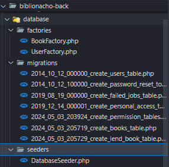
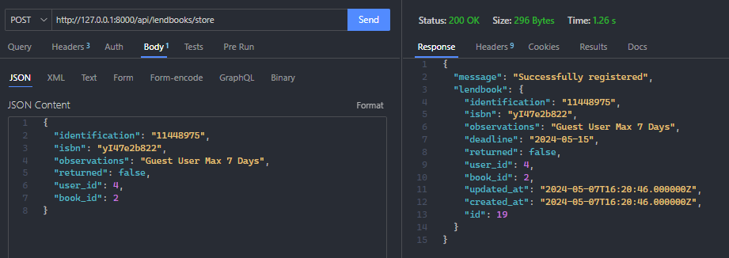
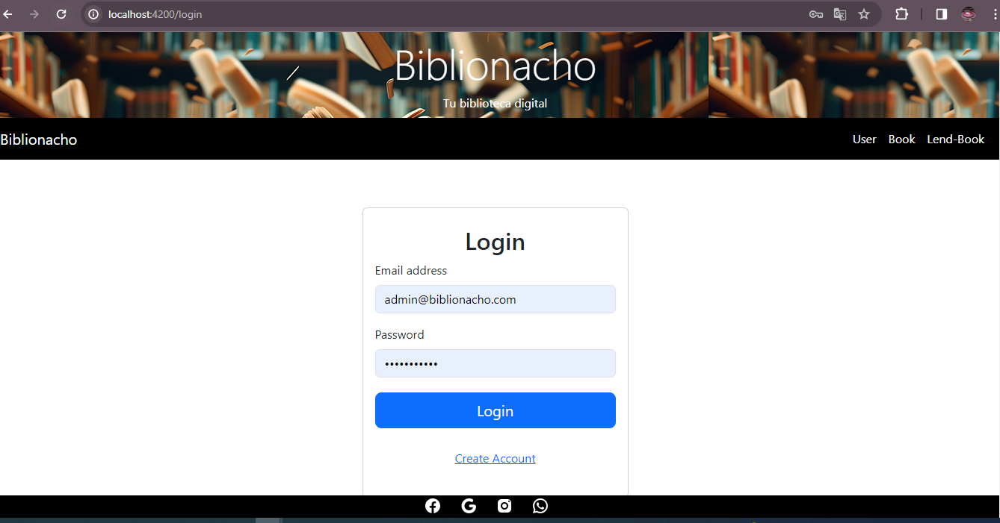

# biblionacho

"An application that allows the borrowing of books from a virtual library, managing permissions according to each user's holdings within the application

#Api documentation
http://127.0.0.1:8000/api/documentation#/

#Thunder Client
It is recommended to use the thunder client vscode plugin to correctly display the uris within the application
file: API_URI_Biblionacho.json

Recomendaciones:

Luego de ingresar a las carpetas correspondientes descargar las dependecias con sus repetivos comandos:
npm install
composer install

Paso siguiente es ejecutar las migraciones para obtener las tablas en la base de datos, de preferencia PostgresSql,
luego de esto podremos reali?ar los seeder para poblar nuestas tablas con registros de prueba para facilitar
el uso de la misma.

posterior a esto recomiendo visualia?r la documentacion de la api para tener una idea general de la aplicacion,
link en la parte superior en donde se podran visuali?ar diferentes funcionalidades, de Authenticacion de Usuario haciendo
uso de JWT, Laravel Permission, Creacion de Libros, usuarios entre otros

Luego de ver la documentacion por temas tecnicos, Recomiendo el uso de postman o Thunder Client para poder
probar nuestra api de esta manera, tendremos menos incovenientes a la hora de ver todas las deas funcionalidades
como generar un prestamo, para esto en nuestras solictudes debemos impletar la Authoriacion Barer para validar

Prestamo para el Usuario con Rol Guest o invitado:

Logica de negocio para los distintos roles:

aspectos en funcionalidades donde por ejemplo dependiento el usuario, y su rol determina la cantida de dias ma?imos para
retornar, para esta funcionalidad hacemos uso de carbon y otros plugins que nos permite determinar aspetos de negocio
en donde por ejemplo si la fecha de entrega cae un dia no habil buscara el dia habil mas cercano, como estas
otras tantas fucnionalidades en el back que nos facilitaran el consumo con menos recursos del lado del cliente.

En el cliente o Fornt hemos implementado angular, en donde tendremos la representacion visial de algunos datos alcandos a realiar, como la protecion de rutas con guard, inteceptor, y otros aspectos a tener en cuenta que nos restringiran
ciertas acciones como:

eliminar un libro si tiene de rol Empleado, afiliado o diferente de admistrador hay ciertos recuersos a los que no podras acceder, ya que intentamos acceder a un recurso protegido
como lo es el Eliminar Un Libro de la biblioteca, Editar u Eliminar es probables te salga
un Mensaje similar:

para el tema de invitados, afiliados etc podran generar un prestamo de sin restricion teniendo en cuenta que los datos
son validos y existen en la base de datos.

El intentar Acceder los registor de todos los usuarios en la biblioteca es un accion que no podria realizar un perfil diferente al de admin

usuario admin:
"email": "admin@biblionacho.com",
"password": "biblionacho"

usuario afiliado:
"email" : "affiliate@biblionacho.com",
"password": "affiliate"

usuario guest:
"email" : "guest@biblionacho.com",
"password": "guest"
"# LaravelPdf" 
